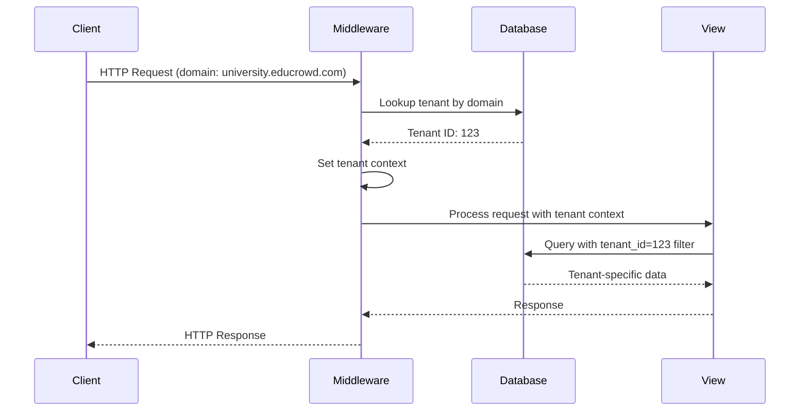
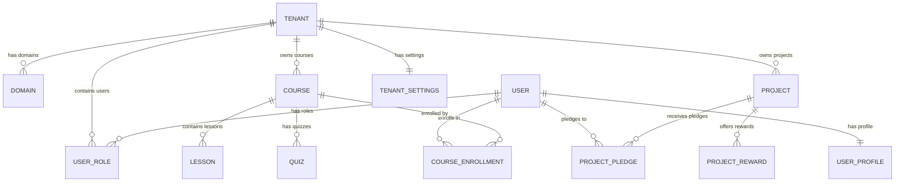
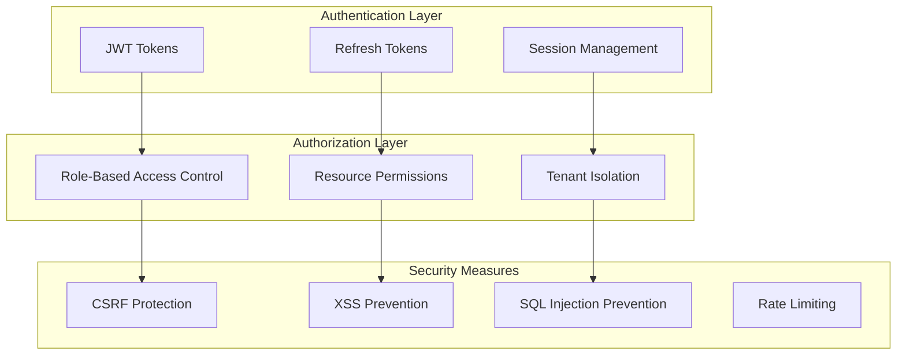
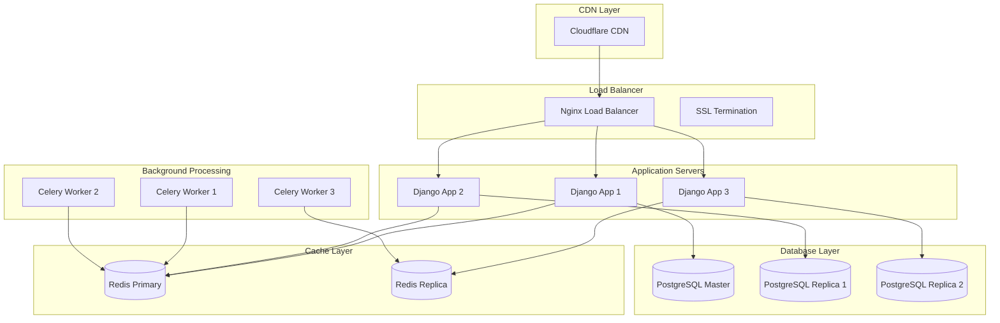

# 🏗️ EduCrowd Architecture Documentation

## 📋 Table of Contents

1. [System Overview](#system-overview)
2. [Multi-Tenant Architecture](#multi-tenant-architecture)
3. [Database Design](#database-design)
4. [API Architecture](#api-architecture)
5. [Security Model](#security-model)
6. [Deployment Architecture](#deployment-architecture)
7. [Scalability Considerations](#scalability-considerations)
8. [Integration Patterns](#integration-patterns)

## 🎯 System Overview

EduCrowd is a comprehensive multi-tenant SaaS platform that combines three core modules:

- **Multi-Tenant SaaS**: Secure tenant isolation and management
- **Learning Management System (LMS)**: Course delivery and progress tracking
- **Crowdfunding Platform**: Project funding and payment processing

### Core Principles

1. **Tenant Isolation**: Complete data separation between tenants
2. **Scalability**: Horizontal scaling capabilities
3. **Security**: Multi-layered security approach
4. **Modularity**: Loosely coupled, highly cohesive modules
5. **Performance**: Optimized for high throughput and low latency

## 🏢 Multi-Tenant Architecture

### Tenant Isolation Strategy

EduCrowd uses a **shared-schema, shared-database** approach with tenant ID filtering:

```python
# Every tenant-specific model includes tenant_id
class Course(models.Model):
    tenant = models.ForeignKey(Tenant, on_delete=models.CASCADE)
    title = models.CharField(max_length=255)
    # ... other fields
```

### Tenant Resolution Flow



### Tenant Context Management

```python
# Middleware sets tenant context
class TenantMiddleware:
    def __call__(self, request):
        domain = request.get_host().split(':')[0]
        tenant = Tenant.objects.get(domains__domain=domain)
        request.tenant = tenant
        return self.get_response(request)
```

## 🗄️ Database Design

### Core Entity Relationships



### Database Schema Details

#### Tenant Management Tables

```sql
-- Tenants table
CREATE TABLE tenants_tenant (
    id SERIAL PRIMARY KEY,
    name VARCHAR(255) NOT NULL,
    description TEXT,
    email VARCHAR(255),
    website VARCHAR(255),
    timezone VARCHAR(50) DEFAULT 'UTC',
    language VARCHAR(10) DEFAULT 'en',
    currency VARCHAR(3) DEFAULT 'USD',
    is_active BOOLEAN DEFAULT TRUE,
    settings JSONB DEFAULT '{}',
    features JSONB DEFAULT '{}',
    subscription_plan VARCHAR(50) DEFAULT 'free',
    subscription_status VARCHAR(20) DEFAULT 'active',
    subscription_expires_at TIMESTAMP,
    created_at TIMESTAMP DEFAULT NOW(),
    updated_at TIMESTAMP DEFAULT NOW()
);

-- Domains table
CREATE TABLE tenants_domain (
    id SERIAL PRIMARY KEY,
    domain VARCHAR(255) NOT NULL,
    tenant_id INTEGER REFERENCES tenants_tenant(id),
    is_primary BOOLEAN DEFAULT FALSE,
    is_ssl_enabled BOOLEAN DEFAULT TRUE,
    created_at TIMESTAMP DEFAULT NOW()
);
```

#### User Management Tables

```sql
-- Users table (extends Django's AbstractUser)
CREATE TABLE users_user (
    id SERIAL PRIMARY KEY,
    username VARCHAR(150) UNIQUE NOT NULL,
    email VARCHAR(255) UNIQUE NOT NULL,
    first_name VARCHAR(150),
    last_name VARCHAR(150),
    phone_number VARCHAR(20),
    avatar VARCHAR(255),
    date_of_birth DATE,
    bio TEXT,
    is_verified BOOLEAN DEFAULT FALSE,
    is_active BOOLEAN DEFAULT TRUE,
    created_at TIMESTAMP DEFAULT NOW(),
    updated_at TIMESTAMP DEFAULT NOW()
);

-- User roles within tenants
CREATE TABLE users_userrole (
    id SERIAL PRIMARY KEY,
    user_id INTEGER REFERENCES users_user(id),
    tenant_id INTEGER REFERENCES tenants_tenant(id),
    role VARCHAR(20) NOT NULL,
    is_active BOOLEAN DEFAULT TRUE,
    assigned_by INTEGER REFERENCES users_user(id),
    assigned_at TIMESTAMP DEFAULT NOW(),
    expires_at TIMESTAMP,
    UNIQUE(user_id, tenant_id, role)
);
```

### Database Indexing Strategy

```sql
-- Tenant-specific queries optimization
CREATE INDEX idx_courses_tenant_id ON courses_course(tenant_id);
CREATE INDEX idx_projects_tenant_id ON projects_project(tenant_id);
CREATE INDEX idx_enrollments_tenant_user ON course_enrollments(tenant_id, user_id);

-- Composite indexes for common queries
CREATE INDEX idx_user_roles_user_tenant ON users_userrole(user_id, tenant_id, is_active);
CREATE INDEX idx_audit_logs_tenant_date ON tenants_tenantauditlog(tenant_id, created_at);
```

## 🔌 API Architecture

### RESTful API Design

EduCrowd follows REST principles with clear resource-based URLs:

```
# Authentication
POST   /api/v1/auth/register/
POST   /api/v1/auth/login/
POST   /api/v1/auth/logout/
POST   /api/v1/auth/password/change/

# Tenants
GET    /api/v1/tenants/
POST   /api/v1/tenants/
GET    /api/v1/tenants/{id}/
PUT    /api/v1/tenants/{id}/
DELETE /api/v1/tenants/{id}/

# LMS
GET    /api/v1/lms/courses/
POST   /api/v1/lms/courses/
GET    /api/v1/lms/courses/{id}/
POST   /api/v1/lms/enrollments/

# Crowdfunding
GET    /api/v1/crowdfunding/projects/
POST   /api/v1/crowdfunding/projects/
GET    /api/v1/crowdfunding/projects/{id}/
POST   /api/v1/crowdfunding/pledges/
```

### API Response Format

```json
{
  "success": true,
  "data": {
    "id": 1,
    "title": "Python Programming Course",
    "description": "Learn Python from scratch",
    "tenant_id": 123,
    "created_at": "2024-01-01T00:00:00Z"
  },
  "meta": {
    "total": 1,
    "page": 1,
    "per_page": 20
  },
  "errors": []
}
```

### API Versioning Strategy

- **URL-based versioning**: `/api/v1/`, `/api/v2/`
- **Backward compatibility**: Maintain previous versions
- **Deprecation notices**: Clear communication of changes

## 🔒 Security Model

### Authentication & Authorization



### Security Implementation

#### JWT Token Structure

```json
{
  "header": {
    "alg": "HS256",
    "typ": "JWT"
  },
  "payload": {
    "user_id": 123,
    "tenant_id": 456,
    "role": "student",
    "exp": 1640995200,
    "iat": 1640908800
  }
}
```

#### Permission Classes

```python
class TenantPermission(permissions.BasePermission):
    def has_permission(self, request, view):
        if not request.user.is_authenticated:
            return False
        
        # Check if user has access to tenant
        tenant_id = request.tenant.id
        return UserRole.objects.filter(
            user=request.user,
            tenant_id=tenant_id,
            is_active=True
        ).exists()
```

### Data Encryption

- **At Rest**: Database-level encryption for sensitive fields
- **In Transit**: HTTPS/TLS for all communications
- **Application Level**: Encrypted storage for passwords and tokens

## 🚀 Deployment Architecture

### Production Environment



### Docker Configuration

```yaml
# docker-compose.prod.yml
version: '3.8'
services:
  web:
    build: .
    environment:
      - DEBUG=False
      - DATABASE_URL=postgres://user:pass@db:5432/educrowd
      - REDIS_URL=redis://redis:6379/0
    depends_on:
      - db
      - redis
    deploy:
      replicas: 3
      resources:
        limits:
          memory: 512M
        reservations:
          memory: 256M
  
  db:
    image: postgres:15
    environment:
      - POSTGRES_DB=educrowd
      - POSTGRES_USER=postgres
      - POSTGRES_PASSWORD=secure_password
    volumes:
      - postgres_data:/var/lib/postgresql/data
    deploy:
      resources:
        limits:
          memory: 1G
        reservations:
          memory: 512M
```

## 📈 Scalability Considerations

### Horizontal Scaling Strategy

1. **Application Layer**: Multiple Django instances behind load balancer
2. **Database Layer**: Read replicas for read-heavy operations
3. **Cache Layer**: Redis cluster for distributed caching
4. **Background Processing**: Multiple Celery workers

### Performance Optimization

#### Database Optimization

```python
# Query optimization with select_related and prefetch_related
courses = Course.objects.select_related('tenant').prefetch_related(
    'lessons', 'enrollments'
).filter(tenant=request.tenant)

# Database connection pooling
DATABASES = {
    'default': {
        'ENGINE': 'django.db.backends.postgresql',
        'NAME': 'educrowd',
        'OPTIONS': {
            'MAX_CONNS': 20,
            'MIN_CONNS': 5,
        }
    }
}
```

#### Caching Strategy

```python
# Redis caching for frequently accessed data
@cache_page(60 * 15)  # Cache for 15 minutes
def get_course_list(request):
    return Course.objects.filter(tenant=request.tenant)

# Cache tenant settings
def get_tenant_settings(tenant_id):
    cache_key = f"tenant_settings_{tenant_id}"
    settings = cache.get(cache_key)
    if not settings:
        settings = TenantSettings.objects.get(tenant_id=tenant_id)
        cache.set(cache_key, settings, 3600)  # Cache for 1 hour
    return settings
```

### Monitoring and Metrics

```python
# Application metrics
import time
from django.db import connection

class MetricsMiddleware:
    def __init__(self, get_response):
        self.get_response = get_response
    
    def __call__(self, request):
        start_time = time.time()
        response = self.get_response(request)
        process_time = time.time() - start_time
        
        # Log metrics
        logger.info(f"Request processed in {process_time:.2f}s")
        logger.info(f"Database queries: {len(connection.queries)}")
        
        return response
```

## 🔗 Integration Patterns

### External Service Integration

#### Payment Gateway Integration

```python
# Stripe integration
import stripe
from django.conf import settings

class PaymentService:
    def __init__(self):
        stripe.api_key = settings.STRIPE_SECRET_KEY
    
    def create_payment_intent(self, amount, currency, metadata):
        return stripe.PaymentIntent.create(
            amount=int(amount * 100),  # Convert to cents
            currency=currency,
            metadata=metadata
        )
    
    def handle_webhook(self, payload, signature):
        event = stripe.Webhook.construct_event(
            payload, signature, settings.STRIPE_WEBHOOK_SECRET
        )
        return self.process_event(event)
```

#### Email Service Integration

```python
# Celery task for email sending
from celery import shared_task
from django.core.mail import send_mail

@shared_task
def send_welcome_email(user_email, user_name, tenant_name):
    subject = f"Welcome to {tenant_name}!"
    message = f"Hi {user_name}, welcome to our platform!"
    
    send_mail(
        subject,
        message,
        settings.DEFAULT_FROM_EMAIL,
        [user_email],
        fail_silently=False,
    )
```

### API Integration Patterns

#### Rate Limiting

```python
from django_ratelimit.decorators import ratelimit

@ratelimit(key='ip', rate='100/h', method='POST')
def create_pledge(request):
    # Handle pledge creation
    pass
```

#### API Documentation

```python
# Using drf-yasg for API documentation
from drf_yasg.utils import swagger_auto_schema
from drf_yasg import openapi

@swagger_auto_schema(
    operation_description="Create a new course",
    request_body=CourseSerializer,
    responses={
        201: CourseSerializer,
        400: 'Bad Request',
        401: 'Unauthorized',
    }
)
def create_course(request):
    # Course creation logic
    pass
```

## 🔄 Data Flow Patterns

### Event-Driven Architecture

```python
# Event publishing
from django.dispatch import Signal

course_enrolled = Signal(providing_args=["user", "course", "tenant"])

# Event handling
def handle_course_enrollment(sender, user, course, tenant, **kwargs):
    # Send welcome email
    send_welcome_email.delay(user.email, user.first_name, course.title)
    
    # Update analytics
    update_course_analytics.delay(course.id, 'enrollment')

# Connect signal
course_enrolled.connect(handle_course_enrollment)
```

### Background Task Processing

```python
# Celery task for heavy operations
@shared_task
def process_course_analytics(course_id):
    course = Course.objects.get(id=course_id)
    
    # Calculate completion rates
    total_enrollments = course.enrollments.count()
    completed_enrollments = course.enrollments.filter(
        status='completed'
    ).count()
    
    completion_rate = (completed_enrollments / total_enrollments) * 100
    
    # Update course metadata
    course.metadata['completion_rate'] = completion_rate
    course.save(update_fields=['metadata'])
```

This architecture documentation provides a comprehensive overview of how EduCrowd is designed to scale, secure, and perform efficiently in a multi-tenant environment. The modular design allows for easy extension and maintenance while ensuring data isolation and security across all tenants.
