# 🚀 EduCrowd - Multi-Tenant SaaS + LMS + Crowdfunding Platform

A comprehensive Django-based platform that combines Multi-Tenant SaaS architecture, Learning Management System (LMS), and Crowdfunding capabilities into a single, powerful solution.

## 🎯 Project Overview

EduCrowd is designed to solve real-world problems for educational institutions, businesses, and organizations that need:

- **Multi-Tenant SaaS**: Secure, isolated workspaces for multiple organizations
- **Learning Management**: Course delivery, progress tracking, and assessment tools
- **Crowdfunding**: Project funding, payment processing, and donor management

## 🏗️ System Architecture

### High-Level Architecture

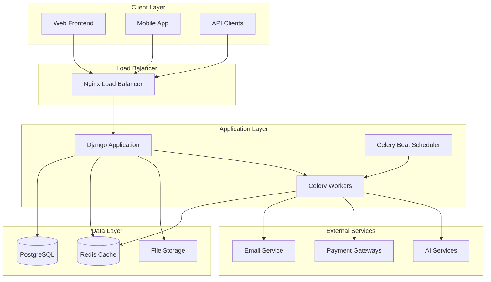

### Multi-Tenant Data Architecture

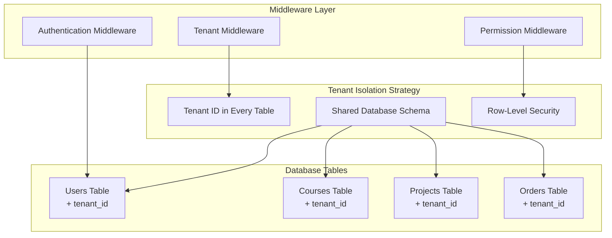

## 📊 Entity Relationship Diagram

### Core Entities and Relationships

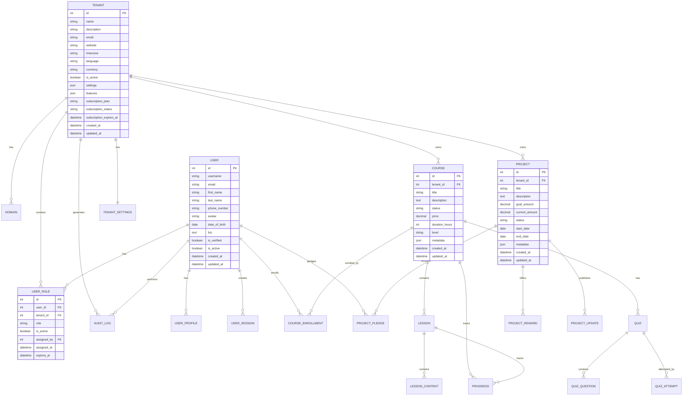

## 🔄 System Flow Diagrams

### User Authentication Flow

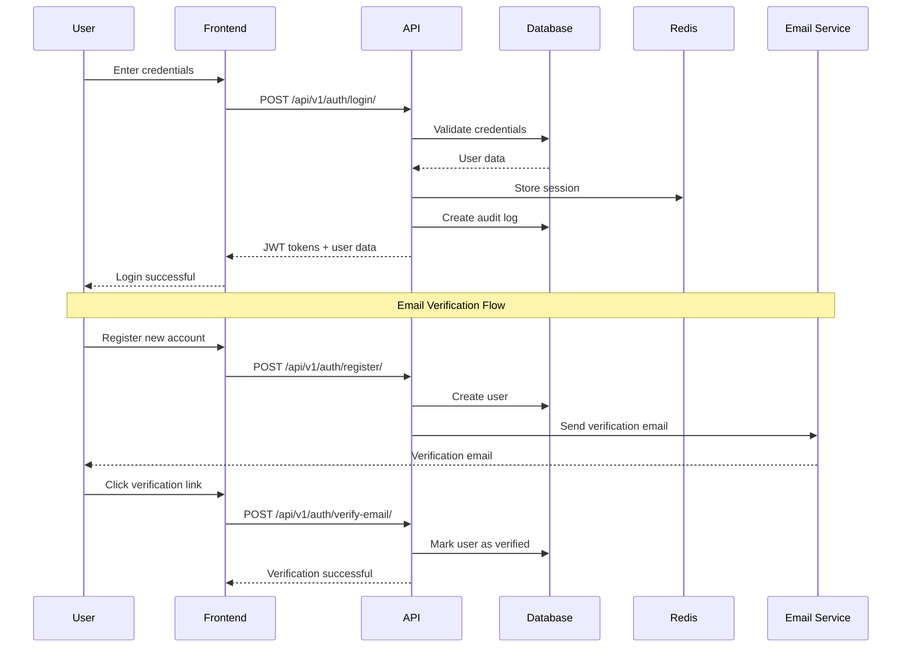

### Multi-Tenant Request Flow

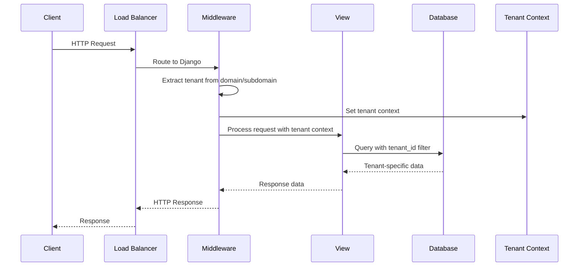

### Course Enrollment Flow

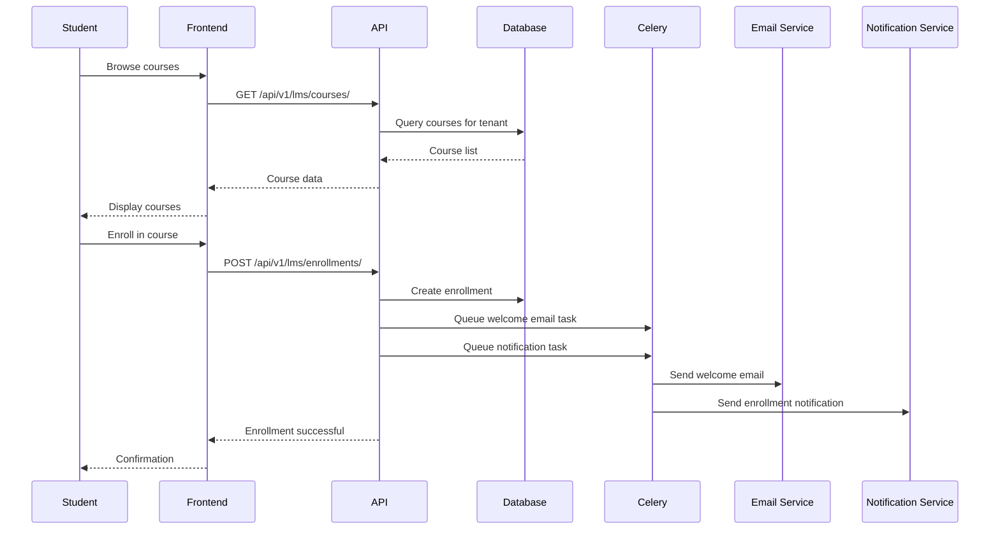

### Crowdfunding Pledge Flow

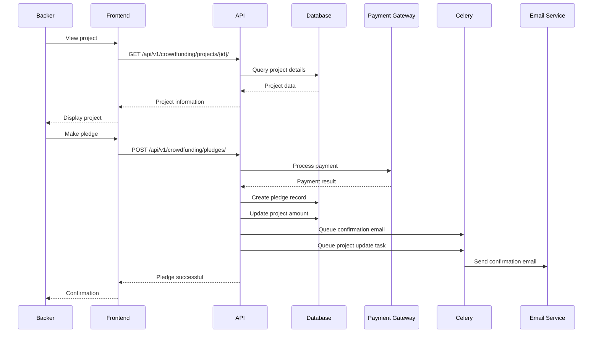

## 🏢 Multi-Tenant Architecture Details

### Tenant Isolation Strategy

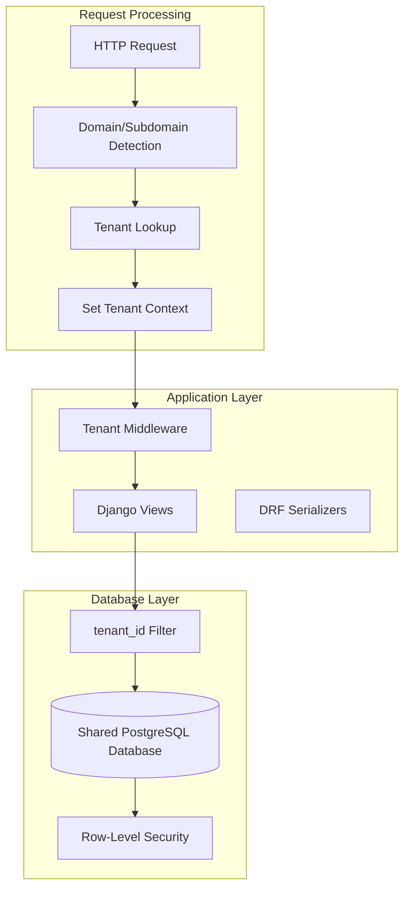

### Data Security Model

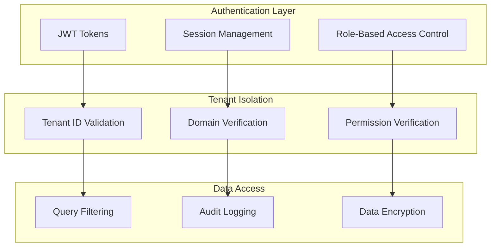

## 🔧 Technology Stack & Integration

### Backend Architecture

```mermaid
graph TB
    subgraph "Django Framework"
        MODELS[Django Models]
        VIEWS[Django Views]
        SERIALIZERS[DRF Serializers]
        MIDDLEWARE[Custom Middleware]
    end
    
    subgraph "Authentication"
        JWT[JWT Authentication]
        ALLAUTH[Django Allauth]
        PERMISSIONS[Django Permissions]
    end
    
    subgraph "Multi-Tenancy"
        TENANT_MW[Tenant Middleware]
        TENANT_MODELS[Tenant Models]
        DOMAIN_MODELS[Domain Models]
    end
    
    subgraph "Background Tasks"
        CELERY[Celery Workers]
        REDIS_QUEUE[Redis Queue]
        PERIODIC[Periodic Tasks]
    end
    
    subgraph "External Integrations"
        STRIPE[Stripe Payments]
        RAZORPAY[Razorpay Payments]
        OPENAI[OpenAI Integration]
        EMAIL_SERVICE[Email Service]
    end
    
    MODELS --> TENANT_MODELS
    VIEWS --> JWT
    SERIALIZERS --> PERMISSIONS
    MIDDLEWARE --> TENANT_MW
    CELERY --> REDIS_QUEUE
    CELERY --> STRIPE
    CELERY --> EMAIL_SERVICE
```

## 📈 Scalability & Performance

### Horizontal Scaling Strategy

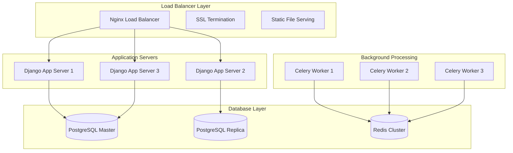

## 🚀 8-Week Development Plan

### Week 1 ✅ - Project Scaffolding
- [x] Django project setup with multi-tenancy
- [x] Docker containerization
- [x] User management system
- [x] Tenant management system
- [x] Basic API structure

### Week 2 - Authentication & Tenant Management
- [ ] JWT authentication implementation
- [ ] Tenant creation workflows
- [ ] Shared-schema tenancy implementation
- [ ] Admin interface enhancements

### Week 3 - LMS Module
- [ ] Course management system
- [ ] Lesson and content management
- [ ] Quiz and assessment system
- [ ] Teacher and student dashboards

### Week 4 - Crowdfunding Module
- [ ] Project creation and management
- [ ] Pledge system
- [ ] Payment integration (sandbox)
- [ ] Backer management

### Week 5 - Billing & Subscriptions
- [ ] Stripe integration
- [ ] Webhook handling
- [ ] Tenant billing model
- [ ] Subscription management

### Week 6 - Real-time Features
- [ ] Redis + Channels implementation
- [ ] Real-time notifications
- [ ] Celery task optimization
- [ ] Email and receipt automation

### Week 7 - Testing & Documentation
- [ ] Comprehensive test suite
- [ ] CI/CD pipeline setup
- [ ] API documentation (Swagger)
- [ ] Performance testing

### Week 8 - Deployment & Production
- [ ] Staging environment setup
- [ ] Security hardening
- [ ] Production deployment
- [ ] Monitoring and logging

## 🏗️ Architecture

### Week 1 - Project Scaffolding ✅
- Django project setup with multi-tenancy support
- Docker containerization
- User management with custom authentication
- Tenant management system
- Basic API structure

### Week 2 - LMS Module (Coming Soon)
- Course and lesson management
- Quiz and assessment system
- Progress tracking and analytics
- Student and teacher dashboards

### Week 3 - Crowdfunding Module (Coming Soon)
- Project creation and management
- Payment gateway integration
- Rewards and perks system
- Real-time analytics

## 🛠️ Technology Stack

- **Backend**: Django 4.2, Django REST Framework
- **Database**: PostgreSQL with multi-tenancy support
- **Cache**: Redis
- **Task Queue**: Celery
- **Containerization**: Docker & Docker Compose
- **Authentication**: JWT + Django Allauth
- **Payment**: Stripe, Razorpay integration
- **AI/ML**: OpenAI, HuggingFace (optional)

## 🚀 Quick Start

### Prerequisites
- Docker and Docker Compose
- Python 3.11+ (for local development)

### Installation

1. **Clone the repository**
   ```bash
   git clone <repository-url>
   cd EduCrowd
   ```

2. **Set up environment variables**
   ```bash
   cp .env.example .env
   # Edit .env with your configuration
   ```

3. **Start with Docker Compose**
   ```bash
   docker-compose up --build
   ```

4. **Run migrations**
   ```bash
   docker-compose exec web python manage.py migrate
   ```

5. **Create superuser**
   ```bash
   docker-compose exec web python manage.py createsuperuser
   ```

6. **Access the application**
   - Web Interface: http://localhost:8000
   - Django Admin: http://localhost:8000/admin
   - API Documentation: http://localhost:8000/api/v1/

## 📁 Project Structure

```
EduCrowd/
├── apps/
│   ├── users/           # User management and authentication
│   ├── tenants/         # Multi-tenant architecture
│   ├── lms/            # Learning Management System
│   ├── crowdfunding/   # Crowdfunding platform
│   └── core/           # Shared utilities
├── educrowd/           # Django project settings
├── templates/          # HTML templates
├── static/            # Static files
├── media/             # Media files
├── logs/              # Application logs
├── docker-compose.yml # Docker configuration
├── Dockerfile         # Docker image definition
└── requirements.txt   # Python dependencies
```

## 🔧 Configuration

### Environment Variables

Key environment variables you need to configure:

```env
# Django Settings
SECRET_KEY=your-secret-key-here
DEBUG=True
ALLOWED_HOSTS=localhost,127.0.0.1

# Database
DB_NAME=educrowd
DB_USER=postgres
DB_PASSWORD=postgres
DB_HOST=localhost
DB_PORT=5432

# Redis
REDIS_URL=redis://localhost:6379/0

# Email (for notifications)
EMAIL_HOST=smtp.gmail.com
EMAIL_PORT=587
EMAIL_USE_TLS=True
EMAIL_HOST_USER=your-email@gmail.com
EMAIL_HOST_PASSWORD=your-app-password

# Frontend URL
FRONTEND_URL=http://localhost:3000
```

## 🎯 Key Features

### Multi-Tenant SaaS Module
- ✅ Tenant registration and management
- ✅ Role-based access control (RBAC)
- ✅ Customizable settings per tenant
- ✅ Audit logs for compliance
- ✅ Secure data isolation

### Learning Management System (LMS)
- 🔄 Course and lesson management
- 🔄 Quiz and assessment system
- 🔄 Progress tracking and analytics
- 🔄 Student and teacher dashboards
- 🔄 AI-powered quiz generation

### Crowdfunding Platform
- 🔄 Project creation and management
- 🔄 Secure payment processing
- 🔄 Rewards and perks system
- 🔄 Real-time analytics
- 🔄 Backer management

## 🔌 API Endpoints

### Authentication
- `POST /api/v1/auth/register/` - User registration
- `POST /api/v1/auth/login/` - User login
- `POST /api/v1/auth/logout/` - User logout
- `POST /api/v1/auth/password/change/` - Change password
- `POST /api/v1/auth/password/reset/` - Request password reset

### Tenants
- `GET /api/v1/tenants/` - List tenants
- `POST /api/v1/tenants/` - Create tenant
- `GET /api/v1/tenants/{id}/` - Get tenant details
- `PUT /api/v1/tenants/{id}/` - Update tenant
- `DELETE /api/v1/tenants/{id}/` - Delete tenant

### Health Check
- `GET /api/v1/core/health/` - System health status

## 🐳 Docker Services

The application runs with the following services:

- **web**: Django application server
- **db**: PostgreSQL database
- **redis**: Redis cache and message broker
- **celery**: Background task worker
- **celery-beat**: Periodic task scheduler

## 🧪 Development

### Running Tests
```bash
docker-compose exec web python manage.py test
```

### Code Quality
```bash
# Run linting
docker-compose exec web flake8 .

# Run type checking
docker-compose exec web mypy .
```

### Database Management
```bash
# Create migrations
docker-compose exec web python manage.py makemigrations

# Apply migrations
docker-compose exec web python manage.py migrate

# Create superuser
docker-compose exec web python manage.py createsuperuser
```

## 📊 Monitoring and Logging

- Application logs are stored in the `logs/` directory
- Celery task monitoring available via Django admin
- Health check endpoint for monitoring: `/api/v1/core/health/`

## 🔒 Security Features

- JWT-based authentication
- Role-based access control
- Multi-tenant data isolation
- Audit logging for compliance
- CSRF protection
- XSS protection
- Secure password validation

## 🚀 Deployment

### Production Deployment

1. **Set production environment variables**
2. **Configure reverse proxy (Nginx)**
3. **Set up SSL certificates**
4. **Configure database backups**
5. **Set up monitoring and logging**

### Environment-specific Settings

- Development: `DEBUG=True`, local database
- Staging: `DEBUG=False`, staging database
- Production: `DEBUG=False`, production database with SSL

## 🤝 Contributing

1. Fork the repository
2. Create a feature branch
3. Make your changes
4. Add tests for new functionality
5. Submit a pull request

## 📝 License

This project is licensed under the MIT License - see the LICENSE file for details.

## 🆘 Support

For support and questions:
- Create an issue in the repository
- Check the documentation
- Review the API endpoints

## 🗓️ Roadmap

### Week 1 ✅
- [x] Project scaffolding
- [x] Docker setup
- [x] User management
- [x] Tenant management
- [x] Basic API structure

### Week 2 (Planned)
- [ ] LMS module implementation
- [ ] Course management
- [ ] Quiz system
- [ ] Progress tracking

### Week 3 (Planned)
- [ ] Crowdfunding module
- [ ] Payment integration
- [ ] Project management
- [ ] Analytics dashboard

---

**Built with ❤️ using Django, Docker, and modern web technologies**
